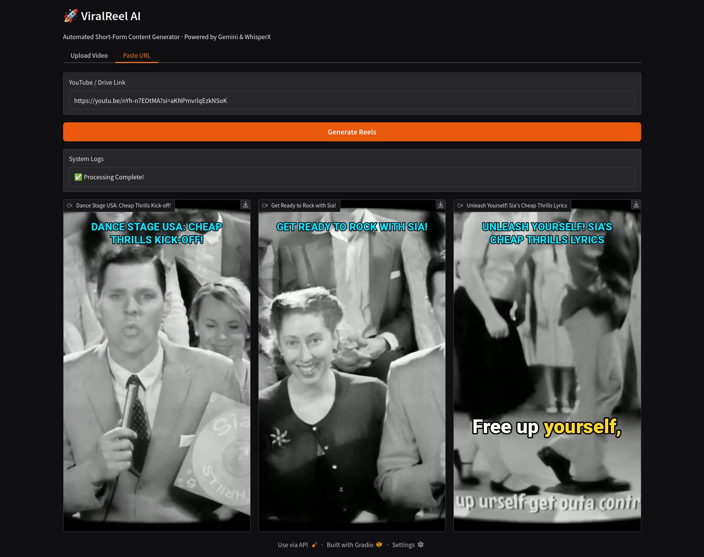

# 🚀 ViralReel AI

> **Turn long-form videos into viral shorts instantly using Generative AI, Computer Vision, and Audio Alignment.**

[](https://huggingface.co/spaces/LakhindarPal/ViralReel-AI)


**ViralReel AI** is a fully automated video repurposing pipeline. It takes a long-form video (YouTube URL or file upload), intelligently analyzes the content to find "viral hooks," and autonomously renders vertical (9:16) shorts with **Face Tracking** and **Karaoke Subtitles**.

Unlike basic wrappers, this project implements a custom rendering engine using OpenCV and Multithreading to achieve better performance.

### 🔴 [Try the Live Demo on Hugging Face](https://huggingface.co/spaces/LakhindarPal/ViralReel-AI)


_(Screenshot of the application interface)_

---

## 🌟 Key Features

- **🧠 AI Content Curator:** Uses **Google Gemini 2.5 Flash** to analyze transcripts and identify the most engaging 30-60 second segments based on viral storytelling principles.
- **🗣️ Word-Level Alignment:** Powered by **WhisperX**, providing millisecond-accurate timestamps for subtitles (Forced Alignment).
- **👀 Smart Face Tracking:** Uses **MediaPipe** to detect the speaker and dynamically crop landscape video into vertical format, keeping the subject centered.
- **⚡ Parallel Rendering Engine:** Renders 3 reels simultaneously using Python `ThreadPoolExecutor`, maximizing GPU/CPU usage.
- **🎨 Custom Karaoke Engine:** A bespoke renderer built on `PIL` and `OpenCV` that draws professional "Alex Hormozi style" subtitles with active word highlighting and auto-wrapping titles.
- **🌐 Universal Downloader:** Integrated `yt-dlp` to download H.264/AVC web-compatible footage.

---

## 🛠️ The Architecture

The pipeline consists of 5 distinct "Brains" working in sequence:

1.  **Ingestion Layer:** Downloads video and extracts raw audio (`16kHz PCM`).
2.  **Transcription Layer (WhisperX):** Transcribes audio and performs forced alignment to get `{word: start_time, end_time}` JSON data.
3.  **Intelligence Layer (Gemini):** Reads the transcript and identifies viral hooks, returning strict start/end timestamps and engaging titles.
4.  **Vision Layer (MediaPipe):** Scans video frames to calculate the "Center of Interest" (Face) for dynamic cropping.
5.  **Rendering Layer (OpenCV + PIL):**
    - Composites the crop.
    - Draws the dynamic karaoke overlay.
    - Encodes to `H.264` (Ultrafast preset) for instant playback on web/mobile.

---

## 🚀 Installation

### Prerequisites

- Python 3.10+
- FFmpeg installed on system (`sudo apt install ffmpeg`)
- GPU recommended (NVIDIA T4 or better for WhisperX)

### 1. Clone the Repository

```bash
git clone https://github.com/LakhindarPal/ViralReel-AI.git
cd ViralReel-AI
```

### 2. Install Dependencies

```bash
pip install -r requirements.txt
```

### 3. Set Up API Keys

You need a Google Gemini API Key (Free tier available at [Google AI Studio](https://aistudio.google.com/)).

Create a `.env` file or export it in your terminal:

```bash
export GOOGLE_API_KEY="your_api_key_here"
```

---

## 💻 Usage

Run the Gradio interface:

```bash
python app.py
```

1. Open the local URL provided (e.g., `http://127.0.0.1:7860`).
2. **Input:** Paste a YouTube URL or upload an MP4 file.
3. **Click:** "Generate Reels".
4. **Wait:** The system logs will update in real-time as it downloads, transcribes, thinks, and renders.
5. **Result:** 3 ready-to-upload viral shorts will appear with their specific titles.

---

## ⚙️ Configuration (Advanced)

You can tweak the constants in `app.py` to change the behavior:

```python
MAX_DURATION = 60       # Hard cap for reel length (seconds)
BATCH_SIZE = 16         # Whisper inference batch size (Lower if VRAM is low)
DEVICE = "cuda"         # "cpu" or "cuda"
```

---

## 🚧 Challenges & Solutions

- **Subtitle Jitter:** Solved by replacing sliding window logic with a "Chunking" algorithm that groups words into blocks of 3 for readability.
- **Web Playback Issues:** OpenCV defaults to raw codecs. Implemented an FFmpeg post-processing step to enforce `yuv420p` pixel format and `libx264` encoding for browser compatibility.
- **403 Forbidden Errors:** Hardened the `yt-dlp` downloader with custom User-Agent headers to mimic a real Chrome browser.

---

## 📜 License

Distributed under the Apache-2.0 license. See [LICENSE](LICENSE) file for more information.

---

<p align="center">
Built with ❤️ by Lakhindar Pal
</p>
